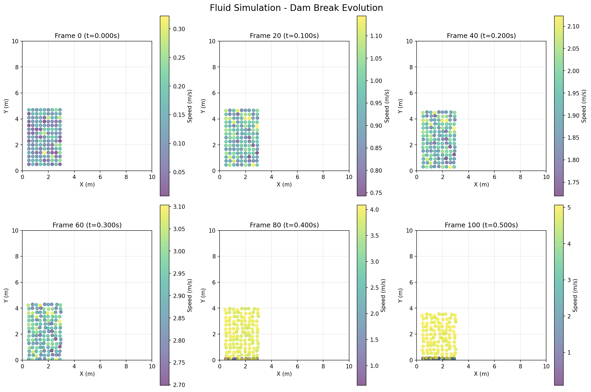

# FLUID-SIM
Little project to simulate fluid with particle interactions.



## Overview

This project implements a fluid simulation using **Smoothed Particle Hydrodynamics (SPH)**, a computational method for simulating fluid dynamics through particle-based interactions. Each particle represents a small volume of fluid and interacts with nearby particles through pressure, viscosity, and gravitational forces.

## Features

- **Particle-based fluid simulation** using SPH method
- **Efficient neighbor search** using spatial hashing
- **Physical forces**: pressure, viscosity, and gravity
- **Boundary collision handling** with damping
- **Real-time visualization** using matplotlib
- **Multiple scenarios**: dam break and water drop

## Physics

The simulation implements the following physical properties:

- **Density computation**: Using Poly6 smoothing kernel
- **Pressure forces**: Using Spiky kernel gradient for repulsion
- **Viscosity forces**: Using viscosity kernel Laplacian for damping
- **Gravity**: Downward acceleration
- **Boundary collisions**: Elastic collisions with damping

## Installation

1. Clone the repository:
```bash
git clone https://github.com/Le-Mouton/FLUID-SIM.git
cd FLUID-SIM
```

2. Install dependencies:
```bash
pip install -r requirements.txt
```

## Usage

Run the simulation with a scenario:

```bash
# Dam break scenario (default)
python main.py

# Dam break scenario (explicit)
python main.py dam_break

# Water drop scenario
python main.py drop
```

The visualization will show:
- Blue particles representing fluid
- Color intensity showing particle velocity
- Real-time animation of fluid dynamics

Close the window to exit the simulation.

## Code Structure

- `particle.py`: Particle class with position, velocity, and physical properties
- `spatial_hash.py`: Spatial hashing for efficient neighbor detection
- `fluid_simulator.py`: Main SPH fluid simulator with physics calculations
- `main.py`: Entry point with visualization and scenarios

## Parameters

Key simulation parameters (in `fluid_simulator.py`):

- `smoothing_radius`: 0.5 - Interaction radius for particles
- `rest_density`: 1000.0 - Rest density of fluid (kg/m³)
- `gas_constant`: 2000.0 - Pressure constant
- `viscosity`: 0.018 - Fluid viscosity (Pa·s)
- `gravity`: [0.0, -9.81] - Gravitational acceleration (m/s²)
- `dt`: 0.001 - Time step (seconds)

## How It Works

1. **Spatial Hashing**: Particles are organized into a grid for O(1) neighbor lookups
2. **Density Calculation**: Each particle's density is computed from nearby particles
3. **Pressure Calculation**: Pressure is derived from density deviation from rest state
4. **Force Computation**: Pressure and viscosity forces are calculated for each particle
5. **Integration**: Forces update velocity, velocity updates position
6. **Boundary Handling**: Particles bounce off domain boundaries

## Requirements

- Python 3.7+
- NumPy 1.21+
- Matplotlib 3.5+

## License

This is a demonstration project for educational purposes.
